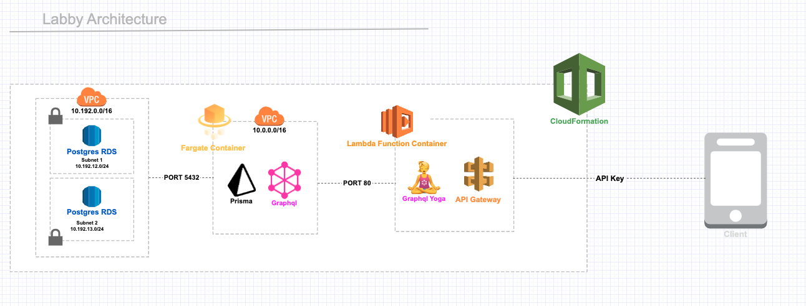

# labby Serverless

## Introduction

This document provides a high level overview and explains the architecture of Labby Serveless. The Document defines goals of the architecture and the use cases supported by this system

## Purpose

This software is intended to be the foundation and source of truth for multiple products that will help run Lambda Labs smoothly at scale. Also, provide a secure way to access relevant information.

## Architecture Representation

AWS cloudformation is used to create 3 differrent stacks:

1. A Postgres RDS
2. A Fargate container with Prisma.
3. A Graphql Yoga Lambda function deployed using serverless and exposed using API Gateway

This service can only be accessed using an API key passed in through the header. The exposed endpoint allows graphql queries and mutations.
